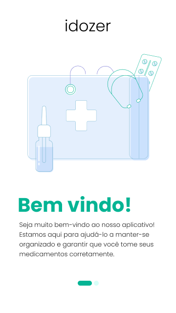
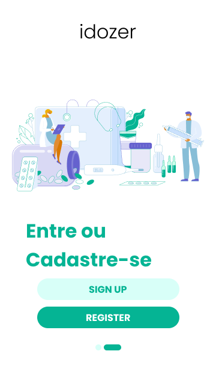
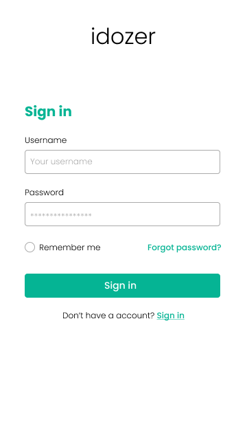
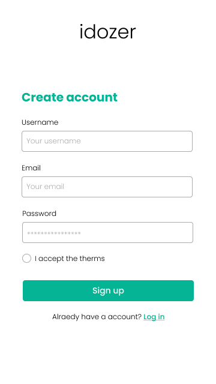
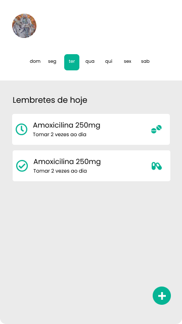
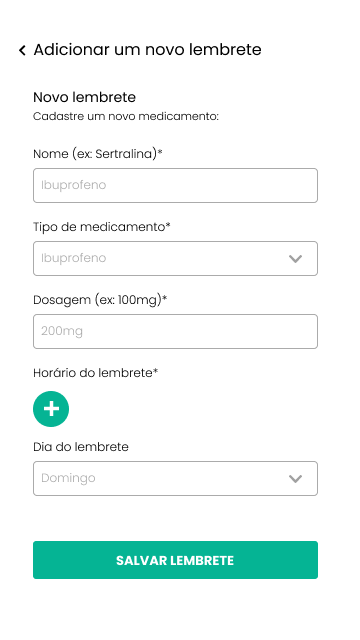

# IDOZER 💊

> **Accessible Medication Reminder Mobile Application for Seniors**
>
> Developed as the final assessment project for the **Mobile Systems Development (DDMI6)** course using **React Native**.

---

## 📋 About the Project 🛠️

**IDOZER** was developed as the final assessment for the **Mobile Systems Development (DDMI6)** course. Its primary objective is to offer a practical, intuitive, and accessible solution to help elderly individuals manage their health through an automated medication reminder application.

---

## 📸 Overview / Screenshots

| Start Screen | Login or Register | Login Screen | Register Screen |
| :---: | :---: | :---: | :---: |
|  |  |  |  |

| Home Screen | Add New Reminder |
| :---: | :---: |
|  |  |

---

## 🛠️ Tech Stack

* **Framework:** [React Native](https://reactnative.dev/)
* **Language:** [TypeScript](https://www.typescriptlang.org/) / JavaScript
* **Course:** Mobile Systems Development (*Desenvolvimento de Sistemas Móveis - DDMI6*)

---
